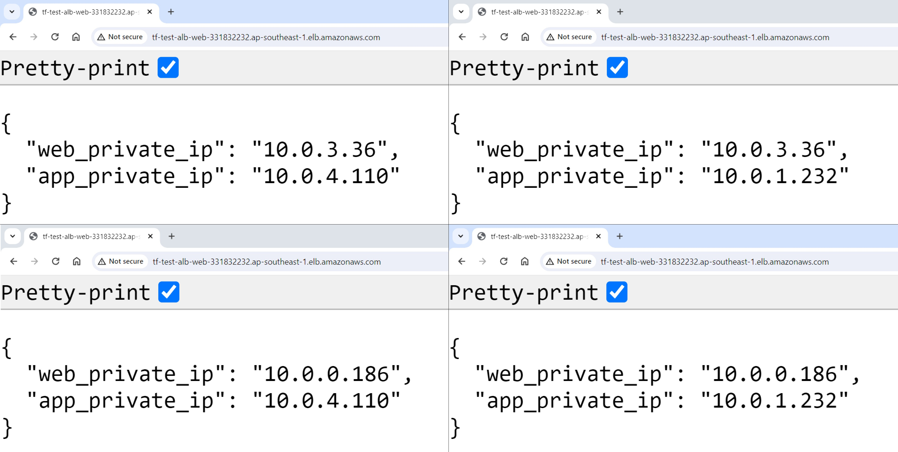

# AWS-Terraform of 3-Tier Architecture with High Availability

An three-tier architecture, infrastructure by AWS and provisioned with Terraform. Ensuring high availability.


## Definition of Done

The returned results will be almost continuously different, alternating between IPs for each web tier and app tier.



## Run

### 1. Credentials

Create a `.tf` file with the following template:

```hcl
provider "aws" {
  region     = "..."
  access_key = "..."
  secret_key = "..."
}
```

### 2. Apply

```hcl
terraform init
terraform plan
terraform apply
```

### 3. Destroy

```hcl
terraform destroy
```
