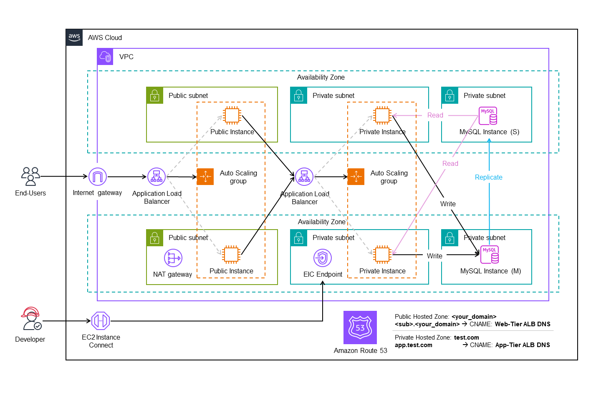

# AWS-Terraform Use Case 1



## Definition of Done

## Run

### 1. Credentials

Create a `.tf` file with the following template:

```hcl
provider "aws" {
  region     = "..."
  access_key = "..."
  secret_key = "..."
}
```

### 2. Apply

```hcl
terraform init
terraform plan
terraform apply
```

### 3. Destroy

```hcl
terraform destroy
```
